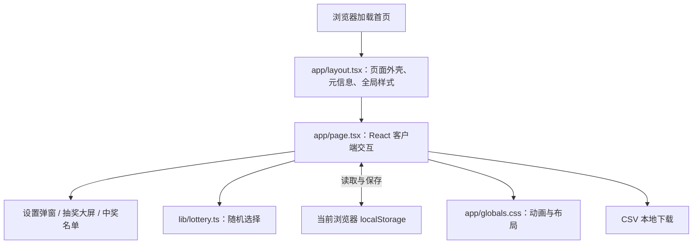
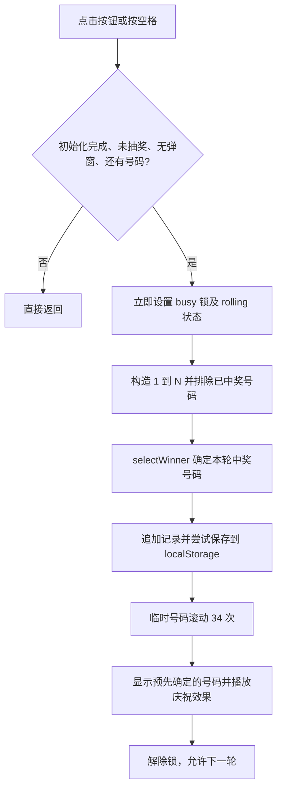

# 进迭时空开发者大会 2026 · 现场抽奖

用于开发者大会现场投屏的单页抽奖应用。工作人员输入实际到场人数 `N`，向参会者连续发放 `1–N` 号，点击按钮或按空格键，每轮抽出一位中奖者。页面以金色大号数字、号码滚动和落下的彩纸展示结果，并自动排除已中奖号码。

本文按当前仓库实现说明，包含现场操作、代码结构、数据流、随机算法、界面动画及维护入口。

## 1. 功能与使用范围

| 功能 | 当前行为 |
| --- | --- |
| 到场人数 | 默认 150，可在后台设置为 1–10000 的整数 |
| 号码范围 | 按 `1–N` 连续生成，不需要导入名单 |
| 奖项名称 | 默认“K1 MUSE PI PRO”，可修改；输入框最多 40 个字符 |
| 单轮抽奖 | 每次抽取 1 人，自动滚动约 3.7 秒后揭晓 |
| 重复中奖 | 同一场记录中，中奖号码不会再次进入候选池 |
| 大屏展示 | 支持浏览器全屏、空格键操作、金色数字和庆祝动画 |
| 中奖记录 | 可查看轮次、号码及奖项，可导出 CSV |
| 刷新恢复 | 本地保存成功时，恢复人数、奖项、中奖记录并展示最后一位中奖者 |
| 重新开始 | 二次确认后清空中奖记录，保留已保存的人数和奖项 |

“后台设置”是首页中的设置弹窗。项目没有单独的管理员路由、管理员账号或服务端抽奖接口；工作人员在同一台电脑上完成设置、抽奖和投屏。

抽奖业务运行在浏览器内。网站使用框架和 Worker 提供页面，但人数及中奖记录没有上传数据库，也没有跨电脑同步。

## 2. 现场操作流程

1. 在固定的工作人员电脑和浏览器上打开页面，只保留一个抽奖操作窗口。
2. 点击右上角“后台设置”，填写实际到场人数和本轮奖品名称，可上传奖品图片，预览后保存。
3. 按 `1–N` 连续发号，每人一号。屏幕上的 `001` 即 1 号，无需把前导零印在号牌上。
4. 点击全屏图标，将浏览器画面投到大屏。
5. 点击“开启幸运时刻”或按空格键；号码滚动结束后，通知中奖者持对应号码领奖。
6. 点击“抽取下一位”继续。更换奖项时进入后台修改名称，之前的中奖者仍不会再次中奖。
7. 点击“已中奖”查看名单或导出 CSV。
8. 演练结束后，进入后台选择“重置本场抽奖记录”，再次确认清空，再开始正式抽奖。

应以实际领取号牌的人数作为 `N`。当前实现不会判断参会者是否仍在现场，也不能跳过某个未到场号码或撤销单条中奖记录。

## 3. 本地运行

### 3.1 环境与安装

`package.json` 要求 Node.js `>=22.13.0`，项目使用 npm 和已提交的 `package-lock.json`。

在本项目目录执行：

```bash
node --version
npm ci
npm run dev
```

`npm ci` 按锁文件安装依赖；如需有意调整依赖，可使用 `npm install` 并检查锁文件变化。开发地址以终端实际打印的 `Local` 地址为准。

不要直接双击源码文件运行：本项目包含 TSX 和框架模块，需要开发服务或构建后的运行环境。

### 3.2 常用命令

| 命令 | 对应脚本或行为 |
| --- | --- |
| `npm run dev` | 执行 `vinext dev`，启动开发服务与热更新 |
| `npm run build` | 执行 `vinext build`，生成部署产物 |
| `npm run start` | 执行 `wrangler dev --config dist/server/wrangler.json`，本地运行构建后的 Worker；需先构建 |
| `npx tsc --noEmit` | 检查 TypeScript 类型，不生成应用 JavaScript |
| `npm run lint` | 执行 Oxlint，按 `.oxlintrc.json` 检查 |
| `npm run format` | 执行 Oxfmt；可能改写文件，运行后应检查差异 |

`npm run start` 是本地运行命令，不会自动发布网站。当前没有 `test` 脚本，也没有已提交的自动化测试套件。

## 4. 技术栈与整体架构

以下版本来自当前 `package.json`，不是对各依赖最新版本的说明。

| 技术 | 当前版本 | 在项目中的用途 |
| --- | --- | --- |
| React / React DOM | 19.2.6 | 页面组件、交互状态、生命周期 |
| TypeScript | 5.9.3 | 类型约束及路径别名 |
| Vinext | 1.0.0-beta.5 | 运行采用 App Router 目录约定的应用 |
| Vite | 8.0.13 | 开发服务、模块转换与构建 |
| Tailwind CSS | 4.2.1 | 通用样式与主题变量映射 |
| shadcn / Base UI | 4.18.0 / 1.7.0 | 本地 UI 组件源码及交互基础组件 |
| Lucide React | 1.31.0 | 设置、全屏、奖杯、下载等图标 |
| Sites Vite 插件 | 0.2.0 | Sites 环境集成 |
| Cloudflare Vite 插件 / Wrangler | 1.37.1 / 4.92.0 | Worker 构建及本地运行 |

源码虽然使用 `next` 类型导入和 `app/` 目录，但实际启动、构建命令是 Vinext，不是 `next dev` / `next build`。



`app/page.tsx` 顶部的 `'use client'` 标明这是客户端交互组件。访问 `localStorage` 的初始化放在 `useEffect` 中，避免在服务端渲染阶段访问浏览器存储；抽奖、下载和全屏 API 则由用户操作触发。

## 5. 目录结构与文件职责

```text
现场抽奖/
├── app/
│   ├── page.tsx                # 首页；集中实现抽奖、设置、记录和交互状态
│   ├── layout.tsx              # 中文页面外壳、暗色主题、标题与分享元信息
│   └── globals.css             # 主题颜色、大屏布局、响应式规则与动画
├── lib/
│   ├── prize-image.ts          # 本地图片格式、体积、解码和尺寸检查
│   ├── lottery.ts              # 独立的随机选取函数 selectWinner
│   └── utils.ts                # cn()：合并条件类名及 Tailwind 类名
├── components/ui/
│   ├── button.tsx              # 按钮基础组件
│   ├── input.tsx               # 输入框基础组件
│   ├── dialog.tsx              # 弹窗及标题、说明、遮罩等组件
│   └── ...                    # 脚手架预置的其他 UI 组件
├── hooks/
│   └── use-mobile.ts          # 预置移动端判断 Hook，当前抽奖首页未直接使用
├── public/
│   ├── favicon.svg            # 浏览器图标
│   └── og.png                 # 网站分享预览图，不是舞台背景或中奖动画素材
├── .openai/
│   └── hosting.json           # 已关联站点的 project_id 及 D1、R2 配置
├── vite.config.ts             # Vinext、Sites、Cloudflare 和 PostCSS 集成
├── next.config.ts             # 框架兼容配置，当前为空配置对象
├── tsconfig.json              # 严格类型检查、JSX、@/* 路径映射
├── components.json            # shadcn 组件工具配置
├── .oxlintrc.json              # 静态检查规则
├── .oxfmtrc.json               # 格式化规则
├── .gitignore                 # 依赖、构建产物、环境文件等忽略规则
├── package.json               # 依赖版本和命令入口
├── package-lock.json          # npm 依赖锁文件
└── README.md                  # 本文档
```

开发或构建后还可能出现 `node_modules/`、`dist/`、`.wrangler/`、`.vinext/` 和 `tsconfig.tsbuildinfo` 等目录或文件。它们用于依赖安装、运行缓存、构建输出或增量类型检查，不是抽奖业务代码。

当前首页直接使用的 UI 基础组件主要是 `Button`、`Input` 和 `Dialog` 系列。`components/ui/` 中其他组件以及相关依赖多数来自脚手架预置，不能据此认为页面已经实现图表、日历等功能。

维护时建议先阅读 `app/page.tsx`，然后阅读 `lib/lottery.ts` 和 `app/globals.css`；修改构建或托管方式时再看 `vite.config.ts`。

## 6. 数据模型与界面状态

### 6.1 持久化业务数据

`app/page.tsx` 中定义：

```ts
type Winner = {
  number: number; // 实际号码，例如 7；前导零仅用于展示
  prize: string;  // 抽取当时的奖项名称
  time: string;   // 抽取时记录的 ISO 时间字符串
  prizeImageId?: string; // 抽取时的图片引用，兼容没有图片的旧记录
};

type State = {
  total: number;      // 已保存的到场人数
  prize: string;      // 当前奖项
  winners: Winner[];  // 按抽取顺序追加的中奖记录
  prizeImageId: string; // 当前奖品图片 ID，无图片时为空
  prizeImages: Record<string, string>; // ID 到本地图片 Data URL 的映射
};
```

默认状态：

```json
{
  "total": 150,
  "prize": "K1 MUSE PI PRO",
  "winners": [],
  "prizeImageId": "",
  "prizeImages": {}
}
```

每条记录单独保存奖项名称，因此后续修改当前奖项不会改写旧记录。时间来自操作电脑的 `new Date().toISOString()`，采用 UTC 表示，并非服务端校准时间。

待抽人数直接派生：

```ts
const remaining = state.total - state.winners.length;
```

这个公式依赖两项约束：记录中的号码不重复，且所有中奖号码均在 `1–total` 范围内。初始化校验、抽取时排除旧号码、缩小人数时的检查共同维护这些约束。

### 6.2 临时界面状态

| 变量 | 用途 |
| --- | --- |
| `ready` | 本机记录读取完成后才允许开始抽奖 |
| `settings` / `history` | 控制后台设置及中奖名单弹窗 |
| `total` / `prize` | 设置表单的草稿字符串，区别于 `state.total` / `state.prize` |
| `error` | 设置校验错误 |
| `notice` | 存储或全屏失败等提示 |
| `rolling` | 是否正在滚动号码，驱动按钮禁用和滚动样式 |
| `number` | 大屏当前显示的号码；滚动中会不断变化 |
| `revealed` | 是否展示中奖文案和庆祝效果 |
| `reset` | 是否显示清空记录的二次确认 |

这些界面状态不会作为独立字段保存。刷新后的界面由业务数据重建，不会从动画中间继续播放。

主要 `useRef` 各有用途：

- `busy`：同步设置的抽奖锁，阻止 React 下一次渲染前的快速重复触发。
- `uploadVersion`：区分异步图片读取请求，关闭弹窗或卸载后忽略过期结果。
- `timers`：收集号码动画的计时器，组件卸载时逐个清理。
- `stateRef`：让只注册一次的可选 WebMCP 工具读取最近一次渲染的业务状态，避免固定捕获初始值。

## 7. 抽奖完整流程

主入口是 `app/page.tsx` 的 `draw()`，按钮和空格快捷键最终调用同一个函数。



### 7.1 候选池与不重复中奖

```ts
const excluded = new Set(state.winners.map(w => w.number));
const pool = Array.from(
  { length: state.total },
  (_, i) => i + 1,
).filter(n => !excluded.has(n));
```

例如总人数为 150，之前中奖的是 8 和 31，则本轮候选池含 148 个号码，8 和 31 被排除。每轮重新构造候选池，因此增加人数后新号码自然加入，修改奖项也不会恢复旧中奖号码。

这部分每轮需要遍历中奖记录和人数范围，时间复杂度约为 `O(N + W)`，其中 `W` 为中奖人数；候选数组和集合的空间复杂度也约为 `O(N + W)`。人数上限目前为 10000，没有预先维护复杂的持久候选池。

### 7.2 先确定结果，再播放动画

抽奖函数先执行：

```ts
const winner = selectWinner(pool);
save({
  ...state,
  winners: [
    ...state.winners,
    { number: winner, prize: state.prize, time: new Date().toISOString() },
  ],
});
```

之后才开始滚动。动画中的临时号码也是从本轮候选池随机选取，但不改变 `winner`。本轮中奖号码是在点击开始时确定的，不由停止时机、动画最后一个随机数或用户手速决定。

这也意味着：

- 中奖计数在动画结束前就已更新。
- 本地保存成功时，即使滚动中刷新，本轮结果仍在记录里，刷新后显示该号码。
- 临时号码可能连续出现相同值，不是按顺序遍历所有候选号码。
- 当前没有“手动停止并定格”功能。

## 8. 随机算法：为什么使用拒绝采样

核心函数位于 [lib/lottery.ts](lib/lottery.ts)：

```ts
export function selectWinner(
  pool: number[],
  fill: (buffer: Uint32Array) => void = buffer => {
    crypto.getRandomValues(buffer);
  },
): number {
  if (!pool.length) throw new Error('No eligible participants');
  const limit = Math.floor(4294967296 / pool.length) * pool.length;
  const buffer = new Uint32Array(1);
  do {
    fill(buffer);
  } while (buffer[0] >= limit);
  return pool[buffer[0] % pool.length];
}
```

### 8.1 随机源

默认使用浏览器 `crypto.getRandomValues()` 填充一个 32 位无符号整数，可表示 `0–2^32−1`，共 `4294967296` 种取值。这里没有使用 `Math.random()`，也没有配置指定中奖人的入口。

### 8.2 直接取模的问题

设候选人数为 `m`。如果直接将整个 32 位范围内的随机数对 `m` 取模，而 `2^32` 不能被 `m` 整除，部分余数会多对应一个原始取值，造成取模偏差。

实现先计算：

```text
limit = floor(2^32 / m) × m
```

只接受小于 `limit` 的随机数；超出或等于边界就重新取样。被接受的范围大小恰好是 `m` 的整数倍，因此每个余数都对应相同数量的输入值。

例如 `m = 150`：

```text
2^32  = 4,294,967,296
limit = 4,294,967,250
丢弃最末尾的 46 个取值
```

随后用 `buffer[0] % m` 得到数组索引。在随机源均匀、候选池中的号码唯一且代码未被修改的前提下，每个候选号码被选中的概率均为 `1/m`。

### 8.3 边界与可测试性

- 空候选池会抛错；页面通过 `remaining` 检查正常情况下不会调用空池。
- 只有一个候选号码时，一定返回该号码。
- 第二个参数 `fill` 可注入固定序列，用于验证拒绝采样，不需要依赖真实随机结果。
- 本函数只负责“从数组选择一个值”，不负责去重或保存；这些职责在 `draw()` 中。

这是浏览器内的随机抽取实现，没有服务端签名或不可篡改审计记录。操作电脑上的代码和存储都可被有权限的人修改，不能把本地记录视为第三方可验证的抽奖证明。

## 9. 本地保存与刷新恢复

### 9.1 存储方式

数据以 JSON 保存到当前页面所属源的 `localStorage`，键名为：

```text
spacemit-lottery-2026-v1
```

`save(s)` 先尝试 `localStorage.setItem()`，成功后才用 `setState(s)` 更新界面并返回 `true`。保存失败时显示提示并返回 `false`，设置、重置和抽奖都会停止本次操作；抽奖不会在记录保存失败后继续播放中奖动画。

同一浏览器中，协议、域名或端口不同通常对应不同的存储空间。本地开发地址、构建预览地址、线上地址之间不会自动共享中奖记录。

### 9.2 初始化校验

首次挂载时读取并解析数据，然后校验：

- `total` 为 1–10000 的整数。
- `prize` 为去除首尾空白后非空的字符串。
- `winners` 为数组。
- 每条记录的号码为整数，且在 `1–total` 范围内。
- 每条记录的奖项和时间为字符串。
- 中奖号码没有重复。

通过后恢复业务数据与设置草稿；存在记录时，显示数组最后一项对应的号码，并进入已揭晓状态。

读取或校验失败时，页面提示无法读取记录，保留默认数据并结束初始化。它不会自动修复、迁移或删除损坏的数据，也不会强制阻止后续抽奖；后续保存可能覆盖原存储。因此遇到提示应先核对记录，再进行操作。

当前校验只确认时间字段是字符串，没有验证它是否是有效 ISO 时间，也没有校验记录来源。

### 9.3 单窗口限制

代码没有监听 `storage` 事件，也没有跨标签页锁。两个页面可能各自持有旧状态，造成重复抽取或互相覆盖记录。`busy` 只保护当前组件实例，不能保护另一个窗口。

请固定使用一台电脑、一个浏览器、一个操作页面。CSV 是导出凭据，目前没有 CSV 导入或恢复功能。

## 10. 后台设置如何生效

设置入口会将已保存的 `state.total` 和 `state.prize` 复制到表单草稿。关闭弹窗但不保存，不会改变业务配置。

点击“保存并返回大屏”调用 `apply()`：

1. 用正则和数值检查共同确认人数是 1–10000 的整数。
2. 检查是否存在大于新人数的已中奖号码，有则拒绝保存。
3. 去掉奖项名称首尾空白，拒绝空名称。
4. 为图片复用或生成 ID，保留当前奖品和历史记录引用的图片，移除没有引用的图片；保存新配置并保留全部中奖记录。
5. 关闭弹窗，清除当前展示号码和揭晓状态，回到待抽界面。

| 操作 | 对候选池和记录的影响 |
| --- | --- |
| 150 改为 180 | 151–180 加入后续候选池；旧中奖者仍排除 |
| 150 改为 100，曾抽中 120 | 拒绝保存，避免产生超出人数范围的记录 |
| 150 改为 100，中奖号码均不超过 100 | 可以保存；101–150 不再参与 |
| 修改奖项名称 | 旧记录保留原奖项，新一轮使用新名称 |
| 重置记录 | 清空 `winners`，所有 `1–N` 号码恢复参与资格 |

重置保留的是已经保存的业务配置，不会自动保存当前表单里尚未提交的草稿。重置的二次确认位于同一弹窗，通过 `reset` 状态切换显示。

## 11. 视觉与动画实现

舞台效果主要由 [app/globals.css](app/globals.css) 和首页中的少量装饰节点组成，没有视频背景、Canvas 粒子引擎或音效系统。

### 11.1 黑金舞台

- `:root` 和 `.dark` 定义背景、前景、主色、边框及弹窗颜色，再通过 `@theme inline` 映射到 Tailwind。
- `.stage` 使用径向渐变提供中心暖光；`.ambient` 用重复渐变生成散落光点。
- 伪元素通过模糊和旋转生成环境光，`.orbit` 椭圆边框围绕数字。
- `.number` 使用渐变文字裁切、阴影及等宽数字特性，减少切换号码时的宽度抖动。

`digits()` 用 `padStart()` 将号码补齐到至少三位；人数达到四位或五位时，动态号码的补齐长度随之增加。底部号码范围左端目前写死为 `001`，右端采用动态格式。

### 11.2 号码减速滚动

`animate()` 共执行 34 次，第一次立即运行，随后用递归 `setTimeout` 调度，延迟为：

```ts
45 + tick * 4
```

第 1 到第 33 次调度之间的总等待时间为：

```text
Σ(45 + 4 × tick), tick = 1…33
= 3705 ms
```

逐步增加间隔形成减速感；真实耗时还受浏览器调度影响。滚动期间 `.rolling .number` 使用轻微模糊和 `pulse` 动画；最后一次覆盖为预先选好的中奖号码。

### 11.3 揭晓与彩纸

- `revealed` 为真时，主容器增加 `.revealed` 类。
- `reveal` 关键帧持续 0.8 秒，数字从缩小状态放大，再回到正常大小。
- 页面创建 90 个彩纸节点，位置、颜色、延迟和持续时间根据索引计算。
- `fall` 关键帧负责下落、旋转和透明度变化；`pointer-events: none` 使彩纸不影响按钮点击。
- 彩纸容器以中奖人数作为 `key`；下一轮先隐藏，揭晓时重新挂载并播放。

### 11.4 响应式与无障碍

页面用 `clamp()`、视口单位和媒体查询适配尺寸；宽度不超过 650px 时压缩标题、工具栏和统计区域，高度超过 950px 时增加舞台留白。

设置与记录使用 Dialog 基础组件；全屏按钮带无障碍名称，设置错误使用 `role="alert"`。快速变化的大号数字对屏幕阅读器隐藏，由单独的 `role="status"` 区域报告等待、抽奖中或中奖结果。

系统启用减少动态效果时，CSS 会关闭动画、过渡和彩纸，但 JavaScript 的号码切换和约 3.7 秒等待仍然执行。

## 12. 键盘、全屏与防重复触发

空格监听挂在 `window` 上，满足以下条件才交给 `draw()`：

- 按键代码为 `Space`。
- `event.repeat` 为假，忽略长按产生的重复按键。
- 焦点不位于按钮、输入框、文本域、选择框、弹窗或可编辑元素内部。

符合条件后调用 `preventDefault()`，避免空格让页面滚动。按钮获得焦点时，交互交由按钮组件处理，不再由全局快捷键重复触发。

防止重复抽奖有两层：按钮在滚动时禁用，`draw()` 内部同时检查并立即设置 `busy.current`。动画完成后解除锁；组件卸载时清理计时器。

全屏按钮根据 `document.fullscreenElement` 切换调用 `document.exitFullscreen()` 或 `document.documentElement.requestFullscreen()`。异常时提示使用浏览器菜单进入全屏。

## 13. 中奖列表与 CSV 导出

中奖记录在内存中按发生顺序追加。弹窗使用 `slice().reverse()` 将最新记录放在最上方，不改变原数组顺序；轮次根据原始顺序推算，不单独保存。

`exportRecords()` 导出字段为：

```text
中奖号码,奖项,时间
```

导出过程：

1. 按原始抽取顺序遍历记录。
2. 为每个字段加双引号，将内部双引号转义为两个双引号。
3. 对以 `= + @ -` 开头的字段添加前置单引号，处理这几类公式起始字符；这不是覆盖所有表格软件行为的完整净化规则。
4. 使用 CRLF 换行，并添加 UTF-8 BOM，帮助常见表格软件识别中文。
5. 创建 `Blob` 和临时对象 URL，用下载链接保存为 `开发者大会中奖名单.csv`。
6. 一秒后释放对象 URL。

导出的号码为实际整数，不保留大屏前导零；时间保留存储中的 ISO 字符串，不转换为本地显示时间。下载在浏览器本地完成，没有文件上传接口。

## 14. 可选 WebMCP 只读接口

首页启动时检测 `document.modelContext?.registerTool`。不支持的浏览器直接跳过，不影响正常抽奖。

支持时注册：

| 项目 | 定义 |
| --- | --- |
| 名称 | `get_lottery_status` |
| 输入 | 空对象 `{}`，不允许额外字段 |
| 输出 | 当前 `total`、`prize`、`winners`、`hasPrizeImage` 以及派生的 `remaining`；不返回图片 Data URL |
| 行为 | 只读，不触发抽奖、不修改设置、不清空记录 |
| 注解 | `readOnlyHint: true`、`untrustedContentHint: true` |

通过 `stateRef` 读取最近一次渲染的数据；非对象、数组或带额外属性的输入会抛错。工具在组件卸载时通过 `AbortController` 清理，注册失败被捕获，不阻塞页面。

该接口没有等待 `ready` 的逻辑；若在初始化完成前调用，可能返回默认数据。当前环境未完成实际 WebMCP 注册与调用验证，不应将此接口视为已经端到端验证的功能。

## 15. 构建、资源与托管配置

### 15.1 构建入口

`vite.config.ts` 组合三类插件：

- `vinext()`：处理应用模块和框架运行流程。
- `sites()`：集成 Sites 环境。
- `cloudflare()`：以 `vinext/server/fetch-handler` 为入口，配置 Worker 运行和构建。

Tailwind 通过 PostCSS 插件加载。检测到 macOS Seatbelt 沙箱时，开发服务改用轮询监听文件；Wrangler 日志路径和 Miniflare 注册信息路径被放在项目内的 `.wrangler/` 下。

当前构建会产生 `dist/server/index.js`、客户端资源及 `dist/server/wrangler.json`。应按现有 Worker 项目流程发布，不能只复制 `app/` 目录或假定这是已经配置好的纯静态 HTML 导出。

### 15.2 站点关联与存储

`.openai/hosting.json` 保存已有站点的 `project_id`。维护同一站点应复用该关联，不要因为改页面或 README 就重新创建站点。

当前 `d1` 和 `r2` 均为 `null`，表示没有配置业务数据库和对象存储。`vite.config.ts` 中的占位数据库 ID 仅属于预留绑定配置，不代表正在使用一个真实业务数据库。当前抽奖不需要业务 API 密钥。

此前此项目采用的发布流程为：构建成功 → 推送对应源码 → 打包构建产物 → 保存站点版本 → 部署版本。仓库没有提供一条独立的 `npm run deploy` 命令；在线访问权限属于托管平台配置，不等同于本应用实现了管理员身份鉴权。

### 15.3 标题、图标和分享预览

`app/layout.tsx` 设置中文语言、暗色页面外壳、网站标题、描述、Open Graph 和 X 分享元信息。`public/og.png` 是分享预览图，`public/favicon.svg` 是浏览器图标。

`metadataBase` 当前写死了一个站点来源地址。迁移站点或域名时，需要将它与实际访问域名核对，避免分享图片绝对地址指向旧域名。它不是抽奖数据存储配置，也不会自动搬迁 `localStorage`。

## 16. 常见修改入口

| 需求 | 修改位置 | 需要一起考虑的规则 |
| --- | --- | --- |
| 修改默认人数或默认奖项 | `app/page.tsx` 的 `initial` 及表单初始状态 | 已有本地记录会覆盖默认值；新默认值不会自动迁移旧数据 |
| 修改人数上限 | 初始化校验、`apply()`、输入框属性及提示文案 | 三处约束需保持一致，大数字还需检查投屏布局 |
| 调整滚动时长 | `draw()` 内的次数 `34` 和延迟公式 | 最后仍应使用已确定的 `winner`，不要改为临时显示号码 |
| 调整金色、背景、字号 | `app/globals.css` | 同时检查弹窗对比度、窄屏和大屏布局 |
| 调整彩纸数量或样式 | `app/page.tsx` 的彩纸数组及 CSS `fall` | 节点越多越需要关注现场设备性能 |
| 修改大会标题、年份与宣传语 | `app/page.tsx`、`app/layout.tsx`、`public/og.png` | 可见内容和分享元信息保持一致 |
| 修改随机选取方式 | `lib/lottery.ts` | 保留均匀选择与空池边界，不改变去重职责 |
| 调整 CSV 字段 | `exportRecords()` | 保留正确的 CSV 转义，并核对公式字符处理 |
| 增加多人同轮中奖 | 扩展 `draw()`、记录模型及结果展示 | 当前每轮只有一位，不能仅修改文案实现 |
| 跨电脑控制或同步 | 需要新增服务端数据与并发控制设计 | 仅监听本地存储无法解决跨设备问题 |

## 17. 验证情况与现场验收

初次实现时已完成构建、TypeScript 类型检查、单个候选和空候选边界、拒绝采样边界、150 个号码不重复抽取检查，以及本地首页 HTTP 200 检查。这些是此前执行结果；当前仓库没有保存完整自动化测试套件，本次文档更新不代表重新执行了这些检查。

此前未完成浏览器交互、视觉或 WebMCP 端到端测试。正式活动前建议在实际投屏电脑上按以下步骤验收：

1. 输入 150，确认范围、空格操作和首次揭晓。
2. 连续抽取多次，确认号码不重复、记录轮次正确。
3. 修改奖项，确认旧记录仍显示原奖项。
4. 增加人数，确认范围变化；输入 0、小数、超上限值，确认被拒绝。
5. 将人数缩小到已中奖最大号码以下，确认不能保存。
6. 在演练抽奖滚动中刷新，确认已保存结果能恢复。
7. 查看并导出 CSV，核对中文、号码、奖项与时间。
8. 测试全屏、目标分辨率、按钮焦点及弹窗内空格操作。
9. 演练结束后执行二次确认重置，确认记录清空，再配置正式奖项。

现有限制包括：连续数字发号、每轮一位、单浏览器单窗口保存、没有名单导入或单条撤销、没有跨设备后台、没有领取核销和自动化测试套件，也未实现离线缓存或安装式应用。后续扩展应围绕实际现场需求增加，尤其避免将界面上的“后台设置”误解为远程管理系统。


## 18. 中奖奖品图片与名称

### 18.1 操作方式

后台设置中填写“本轮奖品名称”，通过“奖品图片”选择本机文件。支持 PNG、JPG 和 WebP，单张最大 500 KB，图片最大 2000 万像素。图片读取成功后显示缩略预览，可以移除或重新选择，点击“保存并返回大屏”才正式生效。关闭弹窗会放弃未保存的草稿。

号码停止滚动时，中奖号码和奖品卡片一起出现。宽屏中号码在左、奖品图片及名称在右；窄屏改为上下排列。卡片带有淡入、上移、缩放和金色光晕，原有彩纸效果继续保留。没有设置图片时显示奖杯图标，奖品名称仍正常展示。

### 18.2 图片读取与保存

`lib/prize-image.ts` 的 `readPrizeImage()` 先检查文件 MIME 类型和大小，再使用 `FileReader.readAsDataURL()` 读取，最后用浏览器 `Image` 验证内容可解码及像素数。图片保持原始内容，不进行裁剪或压缩。校验失败不会覆盖当前图片。

`prizeImage` 是设置表单草稿，`imageLoading` 控制读取提示及保存按钮禁用；`uploadVersion` 防止弹窗已关闭后，异步读取结果重新写回草稿。图片读取不上传服务器。

图片和业务配置一并存储在原来的 localStorage 键中：`prizeImages` 按图片 ID 保存 Data URL，`prizeImageId` 指向当前图片，每条中奖记录保留抽取时的 `prizeImageId`。相同图片内容复用 ID，避免每位中奖者都复制一份图片。图片仍会占用浏览器存储额度，存储不足时操作会失败并提示，不会继续显示未保存的中奖结果。

修改配置时只保留当前奖品和历史中奖记录引用的图片；重置中奖记录后只保留已保存的当前奖品图片。旧版本没有图片字段的记录会补为空映射和空引用，无需清空原有中奖名单。

### 18.3 结果展示与历史一致性

中奖卡片读取最后一条中奖记录中的奖品名称和图片引用，因此切换下一轮奖品不会改写以前的奖品信息。刷新恢复时也从最后一条记录恢复中奖卡片。中奖名单弹窗仍以号码和名称为主，CSV 仍只导出号码、奖项和时间，不包含图片或图片文件。

相关维护位置：后台上传和中奖卡片在 `app/page.tsx`；图片校验在 `lib/prize-image.ts`；布局和卡片入场效果在 `app/globals.css` 的 `.reveal-layout`、`.awarded-prize`、`.prize-art`、`.prize-preview` 和 `prize-enter` 中。系统减少动态效果设置会关闭卡片入场动画。
